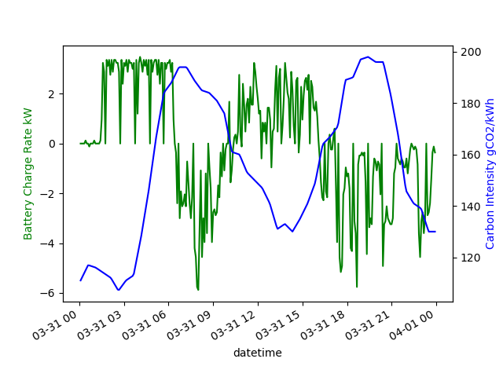
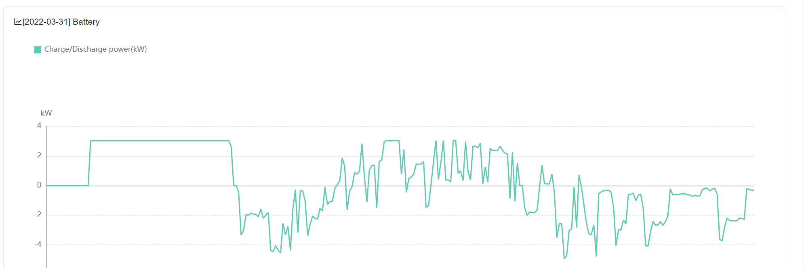
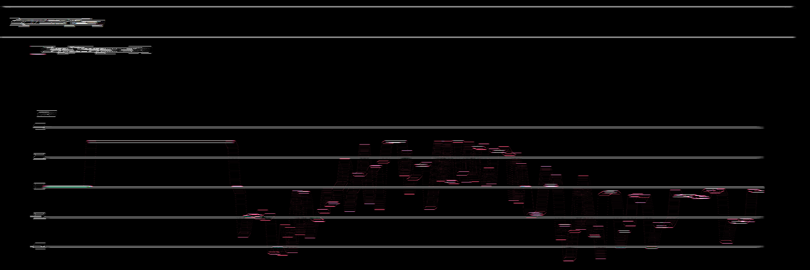
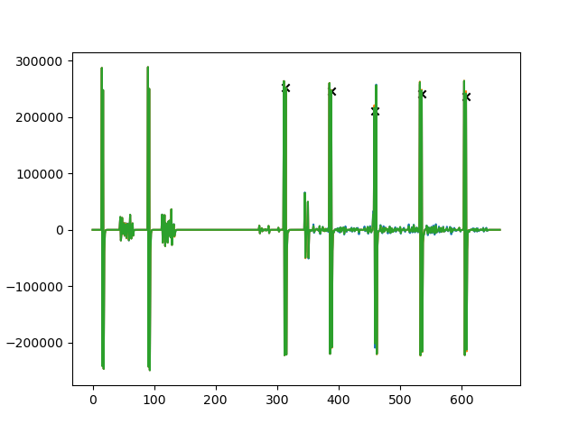
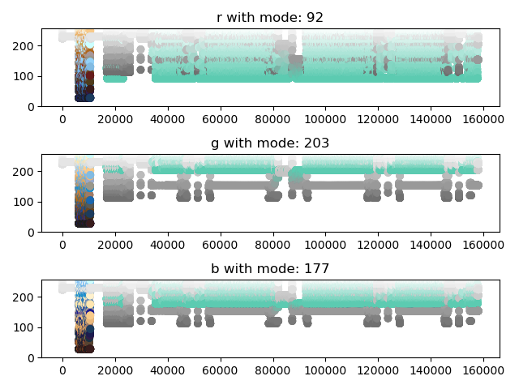
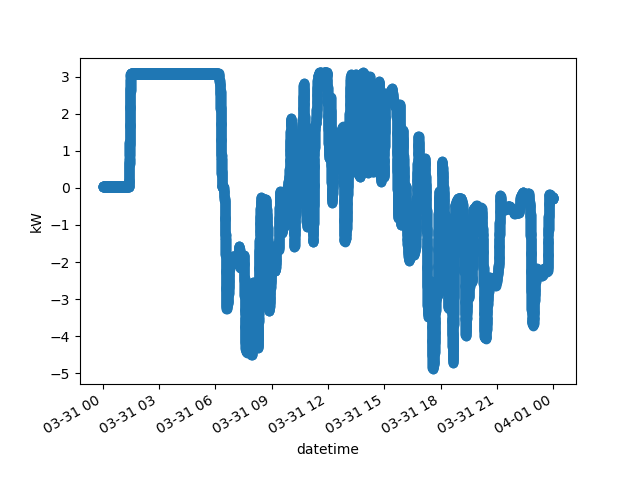

# Carbon Intensity Project
## What is it?

This project aims to look at the carbon intensity of the UK electricity grid over a 24 hour cycle, and optimise the charging/ discharging of a residential household battery to minimse CO2 footprint.

Methods are tested on past carbon intensity, and battery charging, data from the 
national grid to find the possible CO2 reductions that could be made. These methods 
can then be potentially carried forward to implement in real time, by using 24 hour 
predictions of carbon intensity in the national grid.

[Current status] Data ingested. Optimisation problem being established.

## How does it work?
The project uses data from the National Grid ESO's [Carbon Intensity forecast API](https://carbonintensity.org.uk/), with historic predictions and ground truth data.

The carbon intensity API provides data on the carbon intensity of the UK grid, both in the current moment, as well as
for a given time period.

The battery data was provided by a friend who wants to reduce his Carbon Footprint. 

## Where can I find the data?
The data is available in the data folder of the Github repo.

## What Research has been done?
See the Jupyter Notebooks (files ending in `.ipynb`)

Data came in images.

To find the y grid locations in pixel coordinates, I deployed signals processing/ Computer vision methods. Firstly, I convolved the images with a horizontal kernal.

The y axis grid lines have a high response to this horizontal filter, as they are also horizontal lines.

By summing the image response to this filter across the x axis I find the total response for each "row" in the image. This leads to the expected result of  peaks for y axis values that correspond to where the y grid axes are. In image below we see this plot.

Clearly there are also peaks corresponding to the bounding boxe near the top of the images (two horizontal lines offset in y direction, corresponding to the 2 peaks near the left of the below plot). 

Picture this plot rotated 90 degrees. It corresponds to the above image.

Using thresholds, alongside other signals processing methods, we can ignore the noise and find the peaks corresponding to the y grid axis.

This provides us with a systematic way to find the y axis pixel locations. This was checked against the original image, and corresponds perfectly, see image below.

From here, we have the y axis. If we find the rgb values corresponding to the colour of data points in the plots, we can find the pixel locations of all data. This was done by analysing the RGB values of every pixel in the image, alongside the most popular values for each R/G/B, see image below. 

It was found that the most commonly occuring RGB values corresponded to the "teal" colour which was that used for data points. A quick search over the image finds all of these data points. 

Now that we have the coordinates of all the data, we can find the x axis values. Simply, the min x value of data corresponds to midnight (start), and max corresponds to midnight (end).

## How do I use it?
To use this project, you will need to install the following packages:

- pandas
- numpy
- matplotlib
- seaborn
- pandas-profiling
- sklearn
